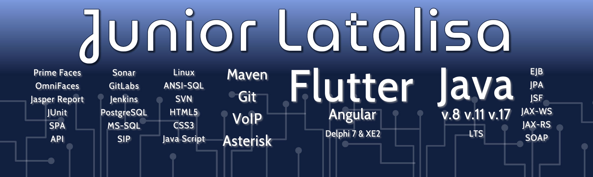

# 

# Consultor Sênior Java 🇧🇷 🇵🇹

✅ ᒍᗩᐯᗩ ✅ ᖴᒪᑌTTEᖇ ✅ ᗩᑎGᑌᒪᗩᖇ ✅ ᗪEᒪᑭᕼI ✅ ᐯOIᑭ ✅

Trabalho com desenvolvimento desde dezembro de 2000. O início foi com Delphi e desde 2005 também com Java, com foco de aplicações para Web.

Em 2010 conheci o Asterisk e as possibilidades deste integrado ao Java para criar aplicações que envolvem VoIP.
Desde 2020 estou encantado com Dart e Flutter para aplicações mobile, front-end, e aplicativos off-line.

## 🏛️ Delphi (desde 2000)

Foco em aplicações Desktop com VCL;

Dados através de API (Rest/SOAP);

Dados por banco de dados relacionais com experiência em SQL;

Relatórios QuickReport/FastReport. Apesar de acreditar que atualmente seria melhor delegar isso a uma ferramenta de BI;

Forte apelo por programação orientada a objeto;

## ☕ Java (desde 2005)

Foco com aplicações Web;

Acredito que apesar da proposta de JSF não estar na moda atualmente ainda tem seu espaço inclusive com Single Page Application;

Dados através de API (Rest/SOAP);

Dados através de JPA/Hibernate. Com experiência em alto volume de dados;

Relatórios com JasperReport. Apesar de acreditar que atualmente seria melhor delegar isso a uma ferramenta de BI;

Ao longo da carreira fiz diversos tipos de integração usando Java;

Destaco as aplicações Java voltadas para VoIP usando a integração com Asterisk;

Teste unitário com JUnit;

Forte apelo por segurança: TLSv3, Content Security Policy (CSP), SQL Injection, etc.;

## 📞 Asterisk (desde 2010)

Experiência voltada para a integração com Java;

## 📱 Dart/Flutter (desde 2020)

Atual paixão para aplicações front-end online ou offline;

## ✅ Outras Tecnologias

Maven, Git, SVN, PostgreSQL, Linux, ANSI-SQL, HTML5, CSS3, JavaScript, Sonar, GitLabs, PrimeFaces, SIP, EJB, JSF, JPA.